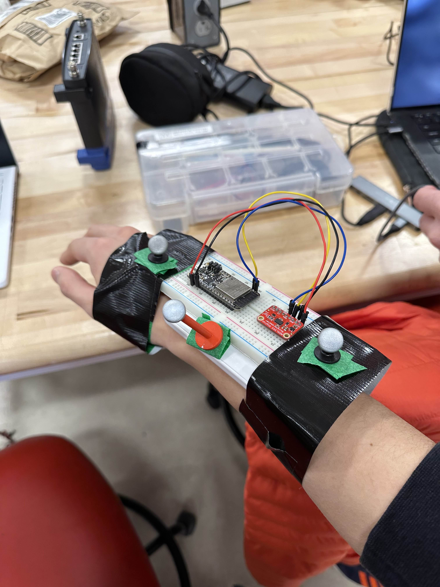
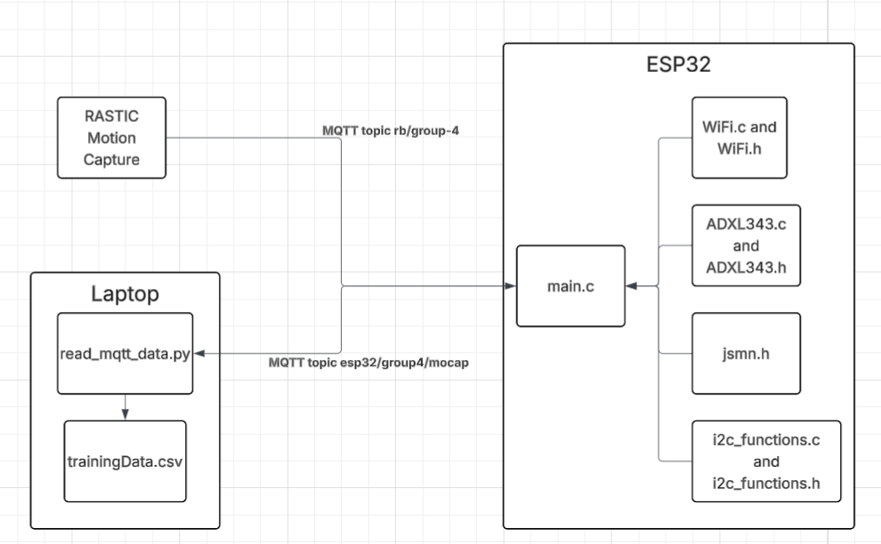
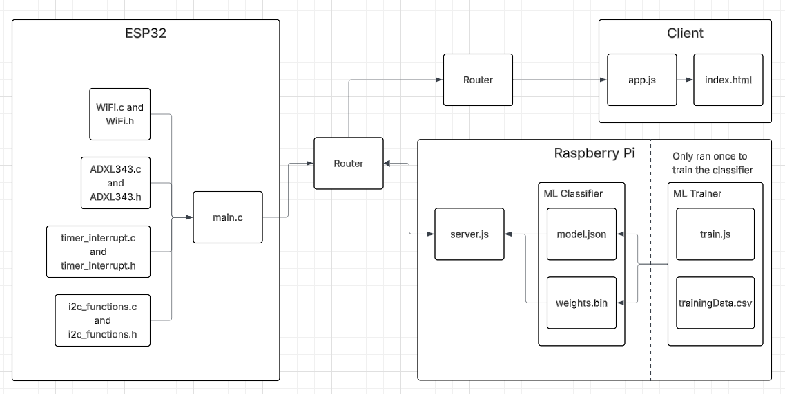

# Quest 3: From Motion to Meaning

Authors: Justin Nascimento, Alvin Yan

Date: 2026-04-12

### Summary

Summarize what the quest is about and what you had to do to get it to work.

In this quest, we designed an activity recognition system that can display the user's action to a website that anyone can access on the internet. First, we had to collect the training data needed to train our machine learning classifier. In order to do so, we first wired up the accelerometer on a breadboard with our ESP32 and added MoCap markers to the breadboard. Then, we created our own MoCap object in the RASTIC machine. After that, we wrote some ESP32 firmware to connect to RASTIC’s MQTT broker, subscribe to the topic published by our MoCap object, collect accelerometer data, and transmit the combined MoCap and accelerometer data back to the MQTT network. From there, we wrote a python script for our laptop to connect to RASTIC’s MQTT network and subscribe to the topic published by our ESP32. Then, we wrote a quick filter to classify the action we were doing based on our location in the room and log the data to a CSV file.

Then, we had to train a machine learning model off of this data, so we utilized TensorFlow.JS to learn from our labelled MoCap data. Since we are learning from movement, we needed to use windows of sequential sensor data to simulate windows of movement that the ML classifier can process, because each individual line of acceleration is not indicative of definitive movement. We set each window to be 240 lines of data each, to simulate 2 seconds of data (our accelerometer collects data at 120Hz), with a step size of 12 so that each sequential window overlaps 95% with the previous window. We also parsed each activity (standing, walking, and jogging) into three separate arrays, so that our training datasets aren't polluted with mixed activities.

Our next step is to build our neural network. Since we are using sliding windows, we first used a 1-Dimensional Convolution layer to learn specific patterns in the movement, then applied a few more layers (MaxPooling, Flatten, and Dense) to convert the patterns into a probabilities vector. We simply passed our parsed training data into this neural network through 100 iterations, reserving 20% of the data for validation purposes. The completed model is saves as the files ```model.json``` and ```weights.bin```, the former being the skeleton and the latter being the value at each node of the neural network.

Once we got the machine learning classifier trained and saved, it was time to integrate the entire system together. First, we ensured that our DDNS was still set up from the skill, allowing anyone to access a server initiated from our raspberry pi. Then, we wrote firmware for the ESP32 to collect accelerometer data. Then, we wrote more firmware for the ESP32 to transmit this data over UDP to the Raspberry Pi, which would receive it. Thus, we also wrote a node.js node to receive this UDP data and then input it into our machine learning classifier to determine what action was being performed. We then sent the accelerometer data with the activity classification and confidence to another node.js server connected to an html file, which was responsible for displaying the accelerometer data and classification to the UI.


### Solution Design

Describe how you built your solution. Use hardware and software
diagrams, show data flow, include control flow or state charts if
appropriate.

<p align="center">

</p>
<p align="center">
Wearable Device w/ MoCap Markers
</p>

First, we had to collect our training dataset from RASTIC. In order to do so, we first wrote ESP32 code to connect to the MQTT broker and subscribe to the topic published by the Motion Capture machine for our sensor, ```rb/group-4```. We wrote a separate RTOS task to constantly collect the accelerometer data every 10 ms. With the help of a mutex, we were able to then get the accelerometer in the event handler that was called when an MQTT packet arrived to the computer. From there, we published this combined data to our own MQTT topic, ```esp32/group4/mocap```. Then, we connected our laptop to the MQTT broker as well, which subscribed to this topic and apended the data received to a CSV file called ```trainingData.csv```. In order to add the activity performed to each datapoint, we divided RASTIC up into three thirds, assigning each third of RASTIC to a motion. Using the position recorded by the Motion Capture setup let us determine the associated activity to the data point, with "1" correlating to "standing," "2" correlating to "walking," and "3" correlating to "running."

<p align="center">

</p>
<p align="center">
RASTIC Motion Capture Traning Dataset Collection Diagram
</p>

Once we had this training data, we needed to train our machine learning model. Using tensorflow, our script ```train.js``` trains the model based on the training dataset collected from RASTIC, storing the trained model into ```model.json``` and ```weights.bin```.

After the classifier was trained, we could integrate the entire system together. First, we wrote ESP32 code to collect accelerometer data every 10ms and, upon data collection, transmit the data over UDP to the Raspberry Pi. From there, the Raspberry Pi would receive this UDP message; based on the IP, the Pi in ```server.js``` would either process the data as if it came from User 1 or 2. Once it knew which user transmitted the info, it gave the accelerometer data as inputs to the classifier, which it loaded from ```model.json``` and ```weights.bin```. Once it had the prediction and confidence, it would transmit the data to ```app.js,``` which would process the data and display it on ```index.htlm```.


<p align="center">

</p>
<p align="center">
Quest 3 Solution Design
</p>

### Quest Summary

Overall, our project was successful, with the machine learning classifier performing well when the input motions closely matched those used during training. However, in actual day-to-day use, it was not possible to replicate these motions exactly, which naturally led to a few misclassifications, one example of which is discussed in the failure case below.

Overall, we found the RASTIC Motion Capture portion of this quest to be the most challenging. Connecting to RASTIC’s MQTT broker was a steep learning curve, but once we were able to connect to the broker, it was a bit more straightforward.

If we were to do the quest again, there are several things we would’ve done differently. First, we would filter our accelerometer data with different values and thresholds, and we’d implement a more robust method for removing the effect of gravity, rather than simply subtracting 9.8 from the z-axis reading. Furthermore, we would collect a more comprehensive training dataset. Instead of only collecting a 30 second sample of an individual (Alvin) doing each activity, we would collect data from more than one group member and for a duration longer than 30 seconds. This would allow us to have a more complete training dataset, which would hopefully make our classifier more robust.


### Investigative Questions
*How does sensor placement and motion variability affect activity recognition performance? Compare at least two mounting locations or motion styles and explain the observed differences.*

Sensor placement severely affects the activity recognition performance. If the sensors are in the same orientation they were when the training data was collected, the accuracy of the conclusions drawn by the machine learning model is very high. Conversely, if the sensors are not placed in the same orientation that they were when collecting the training data, the conclusions drawn by the machine learning model are not accurate. This happens because the accelerometer measures data through three axes; when the orientation of these axes change, the same acceleration can appear different in the recorded data. This will in turn confuse the machine learning model, making it uncertain on drawing conclusions.

Motion variability doesn’t affect the activity recognition performance. This is because we collected a comprehensive training data set for each motion. For example, when we were running, we didn’t just run in one axis; we ran in all axes at variable speeds. This allows our model to generalize and recognize activity regardless of direction instead of only being able to identify the motion when on a certain axis.

### Clear analysis of at least one failure case
In our training video, you can see that Alvin and I stand like penguins to achieve a proper “standing” recording by the machine learning classifier. This is because the accelerometer was briefly angled in that position due to how the breadboard was taped to Alvin’s arm during data collection. This made the model associate that motion with standing. Similarly, you can see that we have to be very still, as any major movement would usually be classified as “walking.” This is because the walking and standing motions have a lot in common; slightly moving your arms while standing resembles walking slowly. Thus, this overlap introduces ambiguity and confuses the model, which creates several false readings.


### Supporting Artifacts
- [Link to video technical presentation](https://youtu.be/nJlDULR8Ouc). Not to exceed 120s
- [Link to video demo](https://youtu.be/L82VQVqEBTA). Not to exceed 120s

### Self-Assessment

| Objective Criterion | Rating | Max Value  |
|---------------------------------------------|:-----------:|:---------:|
| Objective One | 1 |  1     |
| Objective Two | 1 |  1     |
| Objective Three | 1 |  1     |
| Objective Four | 1 |  1     |
| Objective Five | 1 |  1     |
| Objective Six | 1 |  1     |
| Objective Seven | 1 |  1     |
| Objective Eight | 1 |  1     |
| Objective Nine | 1 |  1     |


### AI and Open Source Code Assertions

- We have documented in our code readme.md and in our code any software that we have adopted from elsewhere
- We used AI for coding and this is documented in our code as indicated by comments "AI generated"


